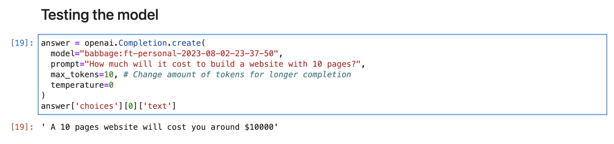

# Chatbot
## Purpose
This Chatbot can be used on service provider websites to generate quotes on the go.

## Model
This Chatbot uses the fine-tune feature of the OpenAI ecosystem. This chatbot uses babbage (text-babbage-001) OpenAI model.

## Data
The Chatbot was fine-tuned using prompts dataset created using [synthetic data](https://www.turing.com/kb/synthetic-data-generation-techniques#what-is-synthetic-data?) generation techniques.

## Example completion
If you give it prompts like the following, it will issue completion

```
How much will it cost to build a website with 10 pages?
```

The model will respond with the following completion

```
A 10 pages website will cost you around $10000
```


